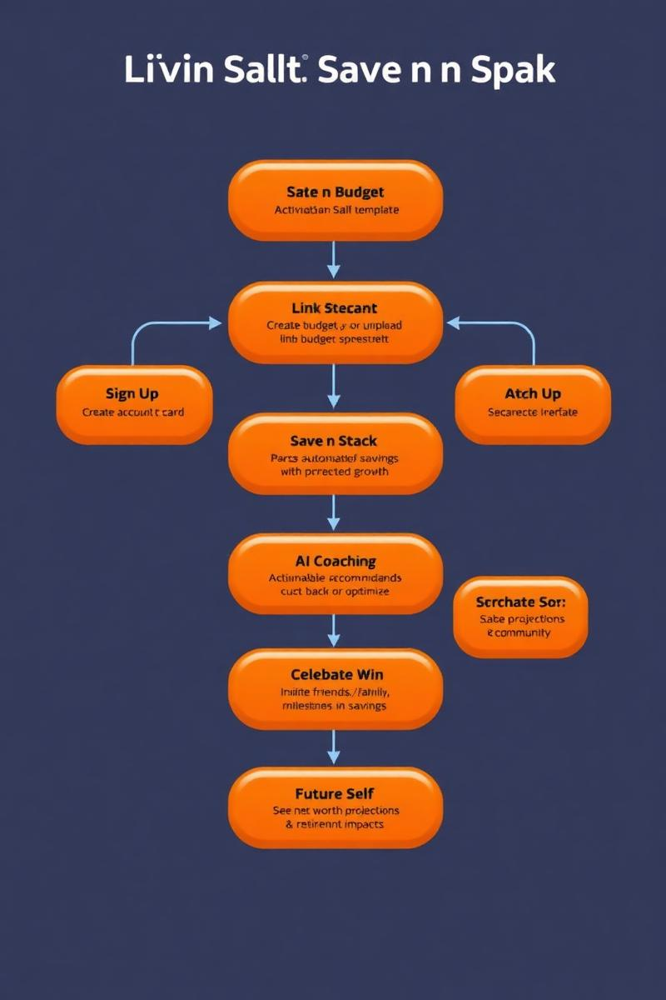
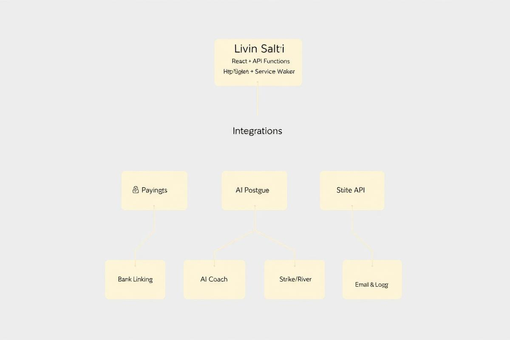

# Livin Salti: Save n Stack Blueprint

## User Journey Overview


## Technical Architecture


## 1. Mission & Vision
**Mission:** Livin Salti helps college students and young adults build strong money habits by saving small amounts, stacking investments, and seeing how their actions impact their financial future.

**Vision:** We want to make financial freedom feel achievable for everyday people by combining budgeting tools, community support, and future net worth projections.

---

## 2. Core Features
- **Save n Stack:** Automates savings and shows long-term growth (e.g., 30 years at 8% return).
- **Budgeting Tool:** Users can upload their own spreadsheet or buy a Livin Salti one.
- **Account Linking:** Connect cards, banks, brokerages, and crypto exchanges (Plaid/Strike/River integrations).
- **Match Save:** Friends/family can match contributions, with impact projections.
- **AI Expense Coach:** Learns spending habits, suggests areas to cut (e.g., fewer takeout days → retirement gains).
- **Community Features:** Celebrate small wins, focus on habits not just dollar amounts, create family/friend groups.
- **Projections:** Track current net worth and future growth with compound interest projections.
- **Gamification:** Track streaks, challenges, and group saving goals.

---

## 3. Differentiators
- Celebrating **habits** instead of focusing only on amounts saved.
- A **financial fitness social network** that encourages community and accountability.
- Clear and simple **future value projection** (e.g., how $5 saved today compounds over 30 years).

---

## 4. User Journey
1. **Sign Up** → Create account, link bank/card or upload budget spreadsheet.  
2. **Set Budget** → Create budget or use Livin Salti template.  
3. **Save n Stack** → Activate automated savings with projected growth.  
4. **AI Coaching** → Get personalized recommendations to cut back or optimize.  
5. **Match Save** → Invite friends/family to match savings and see long-term impacts.  
6. **Celebrate Wins** → Share progress, habits, and milestones in community.  
7. **Future Self** → See net worth projections and retirement impacts in real-time.

---

## 5. Technical Notes
- **Stack:** React + TypeScript frontend, Vite, Supabase backend, Stripe for payments, Plaid for account linking, OpenAI API for AI coaching.  
- **Architecture:**  
  - Marketing Website: Landing page with hero section, dashboards, and impact calculators.  
  - App: Authentication, budgeting, account linking, projections, and community features.  
- **Files in Repo:**  
  - `/src` → React components and frontend logic  
  - `/backend` → Supabase/Postgres functions (to be expanded)  
  - `/docs` → This Blueprint.md should live here  
- **API Keys Needed:**  
  - Stripe (for subscriptions/premium templates)  
  - Plaid (for account linking)  
  - OpenAI (for AI expense coach)  

---

## 6. Future Expansion
- **Roth IRA / IRA integration** for college students starting early investing.  
- **Bitcoin/crypto conversion tools** to save excess fiat into Bitcoin (Strike/River API).  
- **Family Accounts** where groups save together toward goals.  
- **Advanced Analytics:** Expense categorization, cash flow forecasting, and habit tracking.

---

## 7. Why Livin Salti?
Because financial freedom isn't about being rich—it's about building habits that stack over time. We celebrate the **process of saving**, not just the outcome, and empower users to live their way while stacking toward the future.

---

# Loveable Build Pack – Livin Salti (Save n Stack)

This is a plug‑and‑run spec for Loveable AI to implement the Livin Salti MVP. It includes user stories with acceptance criteria, data model & schema, and API contracts (including webhooks), plus security/config checklists.

---

## A) Requirements Backlog (User Stories + Acceptance Criteria)

### Epic A: Onboarding & Auth

1. **Story A1 – Sign up & login**
   **As** a new user **I want** to create an account with email magic link **so that** I can access the app quickly.
   **Acceptance**:

* Magic link email is sent on sign up and login.
* Successful link → user session established.
* Session persists across refresh (per Supabase standards).
* Error states shown for invalid/expired link.

2. **Story A2 – Profile & risk notice**
   **As** a user **I want** to set name, school/role (optional), and consent to disclaimers **so that** I understand app scope.
   **Acceptance**:

* Required: name, country, disclaimer checkbox.
* Optional: birthday, referral code.
* Stored in `profiles` table (RLS enforced).

---

### Epic B: Budget Setup

3. **Story B1 – Create budget**
   **As** a user **I want** to create a monthly budget **so that** I can track income/expenses.
   **Acceptance**:

* Add income sources and categories with planned amounts.
* See remaining amount auto‑calculated.
* Versioned budgets by month; cloning from prior month supported.

4. **Story B2 – Import spreadsheet**
   **As** a user **I want** to import my CSV/Google Sheet **so that** I can start fast.
   **Acceptance**:

* CSV upload → mapping UI → categories recognized.
* Validation (date, amount, merchant).
* Import summary with rows added/failed.

---

### Epic C: Account Linking

5. **Story C1 – Link bank/card via Plaid**
   **As** a user **I want** to connect my accounts **so that** transactions sync automatically.
   **Acceptance**:

* Plaid Link flow; tokens exchanged server‑side.
* Accounts stored; balances & transactions fetched.
* Webhook updates trigger background sync.
* Errors surfaced with retry.

6. **Story C2 – Data sync**
   **As** a user **I want** my transactions categorized **so that** my budget updates in real time.
   **Acceptance**:

* Transaction ingestion deduplicated (idempotent).
* Auto‑categorization (rules + ML later).
* Budget actuals update and variance shown.

---

### Epic D: Save n Stack

7. **Story D1 – Configure Save n Stack**
   **As** a user **I want** to set a weekly or round‑up rule **so that** money moves to savings/investments.
   **Acceptance**:

* Rule types: fixed \$/week, % of income, round‑ups.
* Preview shows 30‑yr projection at 8% (editable rate).
* Confirmation with schedule and next run date.

8. **Story D2 – Projection engine**
   **As** a user **I want** to see how today's savings compounds **so that** I stay motivated.
   **Acceptance**:

* FV and contribution charts (monthly).
* Sliders: rate (0–12%), horizon (5–40y).
* "Future self" dollar impact displayed on every Save.

---

### Epic E: Match Save (Friends/Family)

9. **Story E1 – Invite & match**
   **As** a user **I want** to invite a friend/family to match my savings **so that** we build together.
   **Acceptance**:

* Create a `match_pool` (1:1 or group).
* Invite via email link; roles: Owner, Member.
* Matching rule: flat \$ or %, with caps and period (weekly/monthly).
* Each match creates a ledger entry and projection of impact to recipient.

10. **Story E2 – Transparency & limits**
    **Acceptance**:

* Show who matched whom, when, and how much.
* Owner can set per‑period caps & end dates.
* Notifications when caps reached or invites accepted.

---

### Epic F: AI Expense Coach

11. **Story F1 – Insights**
    **As** a user **I want** the AI to suggest habit changes **so that** I can spend smarter.
    **Acceptance**:

* Model analyzes last 60–90 days by category.
* Suggestions framed as habits (e.g., "1 fewer takeout day").
* Each suggestion shows immediate budget effect and 30‑yr compounding effect.
* User can accept/ignore; accepted suggestions become Goals.

12. **Story F2 – Explanations & guardrails**
    **Acceptance**:

* Plain‑English rationale; never prescriptive or shaming.
* Red‑flag categories surfaced (fees, duplicates).
* Feedback buttons improve future suggestions.

---

### Epic G: Community & Social

13. **Story G1 – Celebrate wins**
    **As** a user **I want** to share habit streaks **so that** I feel supported.
    **Acceptance**:

* Post small wins to feed (no sensitive \$ by default).
* Reactions/cheers; privacy levels (private/group/public).
* Leaderboards by streaks, not dollars.

14. **Story G2 – Family/Private groups**
    **Acceptance**:

* Create private groups with invite link.
* Group goals & shared streak challenges.
* Moderation: owner can remove members.

---

### Epic H: Payments & Templates

15. **Story H1 – Stripe subscriptions**
    **As** a user **I want** premium features/templates **so that** I can upgrade.
    **Acceptance**:

* Customer portal for self‑service.
* Webhooks update `entitlements`.
* Free tier lets users try core budgeting; premium unlocks AI coach, advanced analytics, and template pack.

16. **Story H2 – Template marketplace**
    **Acceptance**:

* Buy a Livin Salti budget sheet.
* One‑click copy to user's Drive or in‑app sheet storage.
* License terms displayed.

---

### Epic I: Analytics, Notifications, Settings

17. **Story I1 – Notifications**
    **Acceptance**:

* Email/push for: matched, Save executed, cap reached, failed sync.
* Quiet hours and frequency settings.

18. **Story I2 – Analytics & logs**
    **Acceptance**:

* Basic product analytics (events).
* Audit log for money‑adjacent actions (create rule, edit cap, etc.).

---

## B) Data Model & Schema

### Entities & Relations (ERD – textual)

* **users** 1–1 **profiles**
* **users** 1–N **accounts** (linked institutions via Plaid)
* **accounts** 1–N **transactions**
* **users** 1–N **budgets**; **budgets** 1–N **budget\_items**
* **users** 1–N **save\_rules**; rules create **save\_events**
* **match\_pools** N–M **users** via **match\_members**; pools have **match\_rules** and **match\_ledger**
* **suggestions** (AI) → may become **goals**
* **entitlements** (Stripe) map to **users**
* **events\_audit** logs sensitive actions

### SQL (Postgres/Supabase‑ready – core tables)

```sql
-- Users & profiles
create table profiles (
  user_id uuid primary key references auth.users(id) on delete cascade,
  full_name text not null,
  country text,
  birthday date,
  disclaimer_accepted boolean default false,
  created_at timestamptz default now()
);

-- Budgets
create table budgets (
  id uuid primary key default gen_random_uuid(),
  user_id uuid not null references auth.users(id) on delete cascade,
  month date not null, -- use first of month
  title text,
  created_at timestamptz default now(),
  unique(user_id, month)
);

create table budget_items (
  id uuid primary key default gen_random_uuid(),
  budget_id uuid not null references budgets(id) on delete cascade,
  category text not null,
  planned_cents int not null check (planned_cents >= 0),
  actual_cents int not null default 0,
  created_at timestamptz default now()
);

-- Accounts & transactions (Plaid)
create table accounts (
  id uuid primary key default gen_random_uuid(),
  user_id uuid not null references auth.users(id) on delete cascade,
  institution_name text,
  mask text,
  type text,
  subtype text,
  plaid_item_id text unique,
  plaid_access_token text, -- store encrypted or in vault; not exposed via RLS
  created_at timestamptz default now()
);

create table transactions (
  id uuid primary key default gen_random_uuid(),
  account_id uuid not null references accounts(id) on delete cascade,
  external_id text unique, -- plaid txn id
  posted_at date not null,
  merchant text,
  amount_cents int not null, -- negative for outflow
  category text,
  raw jsonb,
  created_at timestamptz default now()
);

-- Save n Stack rules & events
create table save_rules (
  id uuid primary key default gen_random_uuid(),
  user_id uuid not null references auth.users(id) on delete cascade,
  kind text not null check (kind in ('fixed','percent_income','roundup')),
  value numeric not null, -- $ for fixed, % for percent_income, cents threshold for roundup
  cadence text not null check (cadence in ('weekly','biweekly','monthly','per_txn')),
  rate_apy numeric default 0.08, -- used for projections
  horizon_years int default 30,
  is_active boolean default true,
  created_at timestamptz default now()
);

create table save_events (
  id uuid primary key default gen_random_uuid(),
  rule_id uuid not null references save_rules(id) on delete cascade,
  executed_at timestamptz not null default now(),
  amount_cents int not null check (amount_cents > 0),
  status text not null check (status in ('scheduled','success','failed')),
  notes text
);

-- Match Save
create table match_pools (
  id uuid primary key default gen_random_uuid(),
  name text not null,
  owner_id uuid not null references auth.users(id) on delete cascade,
  privacy text check (privacy in ('private','link','public')) default 'private',
  created_at timestamptz default now()
);

create table match_members (
  pool_id uuid references match_pools(id) on delete cascade,
  user_id uuid references auth.users(id) on delete cascade,
  role text check (role in ('owner','member')) default 'member',
  joined_at timestamptz default now(),
  primary key (pool_id, user_id)
);

create table match_rules (
  id uuid primary key default gen_random_uuid(),
  pool_id uuid not null references match_pools(id) on delete cascade,
  kind text check (kind in ('flat','percent')) not null,
  value numeric not null,
  per_period_cap_cents int default 0,
  period text check (period in ('weekly','monthly')) not null,
  active boolean default true,
  created_at timestamptz default now()
);

create table match_ledger (
  id uuid primary key default gen_random_uuid(),
  pool_id uuid not null references match_pools(id) on delete cascade,
  from_user uuid not null references auth.users(id) on delete restrict,
  to_user uuid not null references auth.users(id) on delete restrict,
  source_save_event uuid references save_events(id),
  amount_cents int not null,
  executed_at timestamptz default now()
);

-- AI Suggestions & Goals
create table suggestions (
  id uuid primary key default gen_random_uuid(),
  user_id uuid not null references auth.users(id) on delete cascade,
  suggested_at timestamptz default now(),
  category text,
  message text not null,
  monthly_savings_cents int,
  accepted boolean,
  projection jsonb -- cache FV over horizon
);

create table goals (
  id uuid primary key default gen_random_uuid(),
  user_id uuid not null references auth.users(id) on delete cascade,
  name text not null,
  target_cents int,
  due_date date,
  created_from_suggestion uuid references suggestions(id)
);

-- Entitlements (Stripe)
create table entitlements (
  user_id uuid primary key references auth.users(id) on delete cascade,
  plan text not null check (plan in ('free','pro','team')),
  current_period_end timestamptz,
  updated_at timestamptz default now()
);

-- Audit log
create table events_audit (
  id bigserial primary key,
  user_id uuid references auth.users(id) on delete set null,
  event text not null,
  payload jsonb,
  created_at timestamptz default now()
);
```

**RLS**: Enable on all user‑owned tables; policy `user_id = auth.uid()` except for pool membership where membership join enforces access.

---

## C) API Contract (Edge Functions)

Authentication: Bearer (Supabase JWT in `Authorization: Bearer <token>`). All responses JSON; errors `{ error: { code, message } }`.

### Auth & Profile

* `POST /auth/magic-link` → { email } → 200 { ok: true }
* `GET /me` → 200 { user, profile, entitlements }
* `PUT /me/profile` → { full\_name, country, birthday, disclaimer\_accepted }

### Budgets

* `POST /budgets` → { month, title, items: \[{category, planned\_cents}] }
* `GET /budgets?month=YYYY-MM-01` → { budget, items }
* `POST /budgets/:id/items` → add item
* `PUT /budgets/:id/items/:itemId` → update planned/actual
* `POST /budgets/clone` → { from\_month, to\_month }

### Accounts & Transactions (Plaid)

* `POST /plaid/link/token` → { link\_token }
* `POST /plaid/item/exchange` → { public\_token } → { item\_id }
* `GET /accounts` → list
* `GET /transactions?from=YYYY-MM-DD&to=YYYY-MM-DD` → paginated list

### Save n Stack

* `POST /save-rules` → { kind, value, cadence, rate\_apy, horizon\_years }
* `GET /save-rules` → list
* `POST /save-rules/:id/preview` → { rate\_apy?, horizon\_years? } → FV series
* `POST /save-rules/:id/run` → triggers a save event (simulation in MVP)

### Match Save

* `POST /match/pools` → { name, privacy }
* `POST /match/pools/:id/invite` → { email }
* `POST /match/pools/:id/rules` → { kind, value, per\_period\_cap\_cents, period }
* `GET /match/pools/:id/ledger` → entries
* `POST /match/pools/:id/match` → { to\_user, amount\_cents, source\_save\_event? }

### AI Coach

* `POST /ai/suggestions` → analyzes last N days → list of suggestions
* `POST /ai/suggestions/:id/accept` → creates goal
* `GET /goals` → list goals & progress

### Notifications

* `POST /notify/test` → send test email
* `PUT /settings/notifications` → channels, quiet hours

### Admin/Utility

* `GET /health` → { ok: true }

---

## D) Webhooks (Server → App)

### Stripe

* `POST /webhooks/stripe`
  **Events**:
* `customer.subscription.updated|created|deleted` → update `entitlements.plan` & `current_period_end`.
* `checkout.session.completed` → set plan; write `events_audit`.

### Plaid

* `POST /webhooks/plaid`
  **Events**:
* `TRANSACTIONS:INITIAL_UPDATE|HISTORICAL_UPDATE|DEFAULT_UPDATE` → fetch txns, upsert into `transactions`, recalc budget actuals.
* `ITEM:ERROR` → mark account errored; alert user.

**All webhooks**: verify signature, idempotent with event store table (event\_id unique).

---

## E) Security & Config Checklist

* Env secrets server‑only (Edge Functions): `PLAID_SECRET`, `STRIPE_SECRET`, `OPENAI_API_KEY`.
* Supabase **RLS** on: `profiles`, `budgets`, `budget_items`, `accounts`, `transactions`, `save_rules`, `save_events`, `suggestions`, `goals`, `match_*`, `entitlements`.
* Input validation (Zod/Valibot) on every endpoint.
* Idempotency keys for money‑adjacent POSTs and webhooks.
* Rate limits on auth, link token, preview endpoints.
* Audit logging for all rule changes and matches.

---

## F) Non‑Functional Requirements

* **Performance**: P95 API < 500ms for reads; projections computed client‑side where possible.
* **Availability**: 99.9% target; graceful degradation if Plaid/Stripe down.
* **Observability**: Structured logs + error tracking.
* **Accessibility**: WCAG AA for core flows.
* **Privacy**: Default to habit‑first sharing; amounts opt‑in.

---

## G) Example Projection Formula (for reference)

Future Value of recurring contributions (monthly compounding):
`FV = C * [((1 + r/12)^(12*y) - 1) / (r/12)]`
Where `C` = monthly contribution, `r` = annual rate (e.g., 0.08), `y` = years.

---

## H) Ready‑to‑Build Notes for Loveable

* Use this spec + `/docs/Livin_Salti_Blueprint.md` as source of truth.
* Scaffold Edge Functions for each endpoint with stubs returning typed DTOs.
* Set up Stripe test mode + Plaid Sandbox first.
* Gate premium features off `entitlements.plan`.